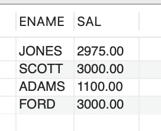
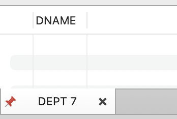
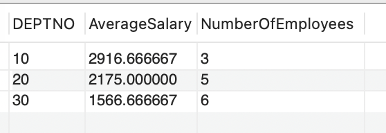

# Assignment 1: Part 3 of 3 documentation

## MySQL Database Queries for COMPANY1

This repository contains SQL scripts and queries for managing and interacting with the "COMPANY1" database. The dataset includes tables related to employees and departments within the company.

### Project Overview

The **COMPANY1** database consists of two main tables:

- **EMP**: Contains employee information such as employee number, name, job, salary, and commission.
- **DEPT**: Contains department details, including department number, name, and location.

The queries provided in this repository are designed to retrieve and manipulate data for various use cases, such as employee salary analysis, department statistics, and more.

### Table Structures

#### EMP Table

| Column   | Description                                                   |
|----------|---------------------------------------------------------------|
| EMPNO    | Employee number (Primary Key)                                  |
| ENAME    | Employee name                                                 |
| JOB      | Job title of the employee                                      |
| MGR      | Manager's employee number (foreign key to EMPNO)               |
| HIREDATE | Hire date of the employee                                      |
| SAL      | Salary of the employee                                         |
| COMM     | Commission received by the employee (if applicable)            |
| DEPTNO   | Department number (foreign key to DEPT)                        |

#### DEPT Table

| Column   | Description                                                   |
|----------|---------------------------------------------------------------|
| DEPTNO   | Department number (Primary Key)                                |
| DNAME    | Department name                                               |
| LOC      | Location of the department                                     |

## Setup Instructions

1. Clone the repository to your local machine:
- git clone https://github.com/yourusername/company1-database.git

2. Create the Database
Create and use the COMPANY1 database in MySQL:
- CREATE DATABASE COMPANY1;
- USE DATABASE COMPANY1;

3. Create the Tables
- Run the script to create the EMP and DEPT tables in the database

4. Insert Sample Data

## Queries
Below are the SQL queries that retrieve specific information from the database:

### 1. List all Employees whose salary is greater than 1,000 but not 2,000

- SELECT ENAME, DNAME, SAL
- FROM EMP E
- JOIN DEPT D ON E.DEPTNO = D.DEPTNO
- WHERE SAL > 1000 AND SAL < 2000;

### 2. Count the number of people in department 30 who receive both a salary and a commission:

- SELECT COUNT(*)
- FROM EMP
- WHERE DEPTNO = 30 AND SAL IS NOT NULL AND COMM IS NOT NULL;

### 3. Find the name and salary of employees that have a salary greater or equal to 1,000 and live in Dallas:
- SELECT ENAME, SAL
- FROM EMP E
- JOIN DEPT D ON E.DEPTNO = D.DEPTNO
- WHERE SAL >= 1000 AND D.LOC = 'DALLAS';

#### **Explanation**:
The purpose of this query is to retrieve the names (`ENAME`) and salaries (`SAL`) of employees whose salary is greater than or equal to 1,000 and who work in the department located in Dallas. The query joins the `EMP` and `DEPT` tables on the department number (`DEPTNO`) and applies the following filtering conditions:

- **The salary condition:** `SAL >= 1000`
- **The location condition:** `D.LOC = 'DALLAS'`

#### **Analysis of Results**:

- **Employee Names and Salaries:** The query successfully retrieves the names and salaries of employees based on the specified salary and location criteria.
- **Department Location:** The query ensures that only employees working in departments located in Dallas are included in the results, by filtering for `D.LOC = 'DALLAS'`.
- **Salary Range:** Only employees whose salary is greater than or equal to 1,000 are included, filtering out those with lower salaries.

### 4. Find all departments that do not have any current employees:
- SELECT DNAME
- FROM DEPT
- WHERE DEPTNO NOT IN (SELECT DISTINCT DEPTNO FROM EMP);

#### **Explanation**:

The query was intended to retrieve the names of departments that currently have no employees. It works by selecting all department names from the DEPT table where the department number (DEPTNO) does not appear in the list of department numbers from the EMP table.

#### **Analysis of Results**:

The query returned no results because every department in the DEPT table has at least one employee in the EMP table. In other words, all department numbers in the DEPT table were present in the EMP table, so the NOT IN condition did not find any matching rows.

5. List the department number, average salary, and number/count of employees of each department:

#### **Explanation:**
This query retrieves the department number (`DEPTNO`), the average salary (`AVG(SAL)`) for employees in each department, and the total number of employees (`COUNT(*)`) in each department. The query uses the `GROUP BY` clause to group the data by department number (`DEPTNO`), calculating the aggregate functions `AVG()` for the average salary and `COUNT()` for the number of employees per department.

The query is structured as follows:

- **DEPTNO:** The department number from the `EMP` table, which is used to group the employees into their respective departments.
- **AVG(SAL):** Calculates the average salary of employees within each department.
- **COUNT(*):** Counts the total number of employees in each department.
- **GROUP BY DEPTNO:** Groups the results by department number to calculate the aggregates for each department.

## Analysis of Results:

- **Department Number:** The query successfully retrieves the department numbers and associates them with the corresponding salary data and employee count.
- **Average Salary:** The `AVG(SAL)` function correctly calculates the average salary for each department, based on the employees assigned to that department. This helps in understanding the pay distribution within each department.
- **Employee Count:** The `COUNT(*)` function returns the number of employees in each department. This provides insight into the size of each department and the distribution of the workforce.

