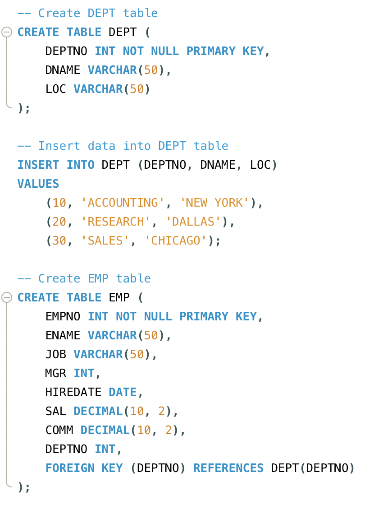
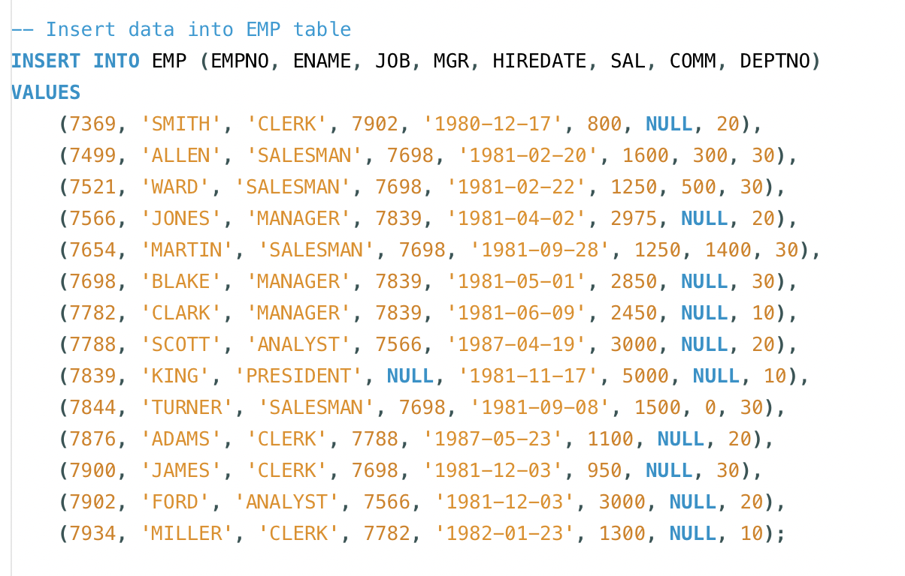
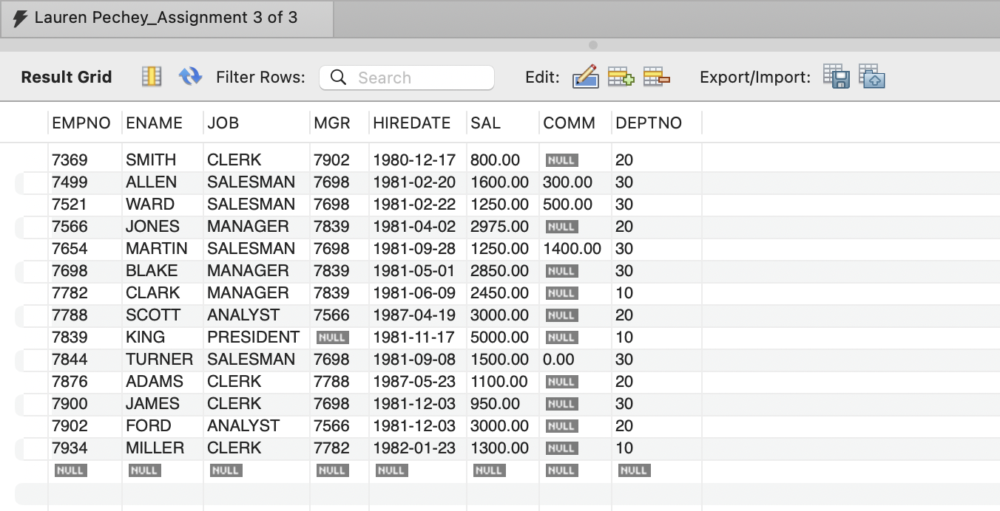
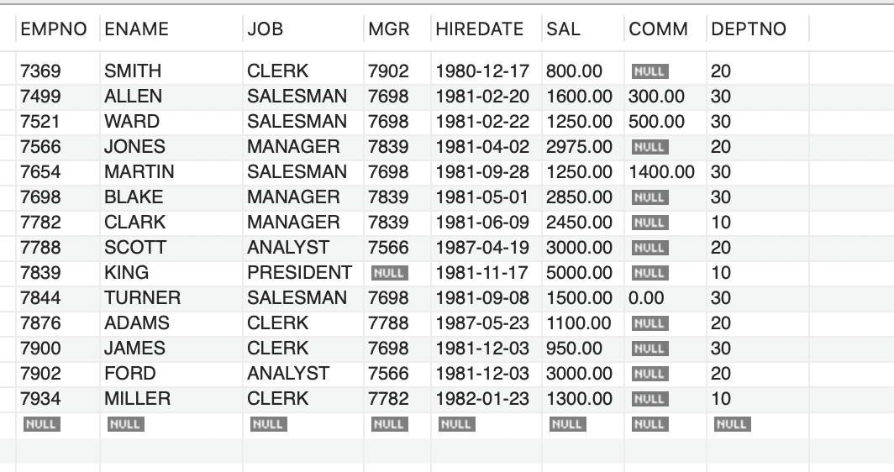
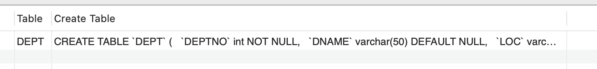
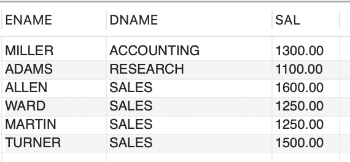

# MySQL Database Queries for COMPANY1

#### By Lauren Pechey

This repository contains SQL scripts and queries for managing and interacting with the "COMPANY1" database. The dataset includes tables related to employees and departments within the company. This forms part of Assignment 1: Part 3 of 3 of the Launching Into Computer Science module with the University of Essex Online.

## Project Overview

### Project Goals

This repository aims to demonstrate practical SQL skills by implementing various queries to interact with the "COMPANY1" database. Through this project, the following goals are achieved:
- Understanding and applying SQL JOINs and filtering conditions.
- Performing aggregation and data analysis tasks using SQL.
- Gaining experience in managing and querying relational databases.

### Summary of Project

The **COMPANY1** database consists of two main tables:

- **EMP**: Contains employee information such as employee number, name, job, salary, and commission.
- **DEPT**: Contains department details, including department number, name, and location.

The queries provided in this repository are designed to retrieve and manipulate data for various use cases, such as employee salary analysis, department statistics, and more.

## Table Structures

### EMP Table

| Column   | Description                                                   |
|----------|---------------------------------------------------------------|
| EMPNO    | Employee number (Primary Key)                                  |
| ENAME    | Employee name                                                 |
| JOB      | Job title of the employee                                      |
| MGR      | Manager's employee number (foreign key to EMPNO)               |
| HIREDATE | Hire date of the employee                                      |
| SAL      | Salary of the employee                                         |
| COMM     | Commission received by the employee (if applicable)            |
| DEPTNO   | Department number (foreign key to DEPT)                        |

### DEPT Table

| Column   | Description                                                   |
|----------|---------------------------------------------------------------|
| DEPTNO   | Department number (Primary Key)                                |
| DNAME    | Department name                                               |
| LOC      | Location of the department                                     |

## MySQL Installation and Setup Instructions

### 1. Install MySQL or MySQL Workbench

- Download and install MySQL or MySQL Workbench from the official website:  
  [MySQL Workbench Download](https://dev.mysql.com/downloads/workbench/)

### 2. Install MySQL Server (if not already installed)

- Download and install MySQL Community Server from the official website:  
  [MySQL Community Server Download](https://dev.mysql.com/downloads/installer/)
  
  - Choose the version based on your operating system.
  - Follow the on-screen instructions to complete the installation.

### 3. Configure MySQL Server

- After installation, launch MySQL Workbench and configure the server by:
  - Setting up a root password when prompted.
  - Choosing the "Development Computer" setup type for a local development environment.
  
### 4. Open MySQL Workbench

- Launch MySQL Workbench.
- Click on the **+** sign next to **MySQL Connections** to set up a new connection.
  
### 5. Set Up a New Connection

- In the **Set up a New Connection** window:
  - **Connection Name:** Enter a custom name for the connection.
  - **Connection Method:** Choose **Standard (TCP/IP)**.
  - **Hostname:** Enter `localhost` (or the IP address of the server if remote).
  - **Port:** Use `3306` (default MySQL port).
  - **Username:** Enter `root` (or your MySQL user).
  - **Password:** Enter the root password you set earlier.

- Click **Test Connection** to ensure everything is set up correctly.

### 6. Start Using MySQL Workbench

- Once the connection is successful, click **OK** to save the connection.
- Double-click on your saved connection to start using MySQL Workbench.
- You can now execute SQL queries, manage databases, and perform various database operations.

## MySQL Initial Database Setup:

### 1. Create the Database
Create and use the COMPANY1 database in MySQL:
- CREATE DATABASE COMPANY1;
- USE DATABASE COMPANY1;

#### *Explanation:*

- **`CREATE DATABASE COMPANY1;`**  
  Creates a new database called `COMPANY1` in MySQL.

- **`USE DATABASE COMPANY1;`**  
  Selects the `COMPANY1` database as the active database for subsequent queries.

#### *Analysis of Results:*

- The `CREATE DATABASE` command initializes the `COMPANY1` database for further use.
- The `USE` command ensures all following operations are executed in the `COMPANY1` database context.

### 2. Create the Tables and Insert Sample Data:

- Run the scripts below to create the EMP and DEPT tables in the database and insert the sample data:

Results:

#### *Explanation:*

The `DEPT` table holds department information, with `DEPTNO` as a unique identifier, and `DNAME` and `LOC` representing the department name and location. The `EMP` table stores employee details, with `EMPNO` as a unique identifier, and includes columns for job title, salary, commission, and `DEPTNO` linking employees to departments. The `MGR` column in the `EMP` table creates a self-referencing foreign key to model employee-manager relationships.

Data is inserted into both tables: three departments (ACCOUNTING, RESEARCH, and SALES) and fourteen employees with varying roles (Clerk, Salesman, Manager, Analyst), each assigned to a department and manager.

#### *Analysis of Results:*

The database structure models a simple organizational hierarchy with departments and employees. The use of primary and foreign keys ensures data integrity, preventing invalid department and manager associations. The foreign key relationships link employees to departments and establish the manager-employee hierarchy within the `EMP` table. This design supports efficient querying of employee details, department affiliations, and manager relationships, making it suitable for organizational analysis and reporting.

### 3. Verify Tables:

#### *Explanations:*

The `SELECT * FROM DEPT` and `SELECT * FROM EMP` queries retrieve all the data stored in the `DEPT` and `EMP` tables, respectively. The `DEPT` table contains details about departments, while the `EMP` table holds employee information. These queries return all rows and columns, providing a comprehensive view of the data in each table.

#### *Analysis of Results:*

Running these queries will display all records from both tables. For the `DEPT` table, the output will list the department numbers, names, and locations. For the `EMP` table, the result will include employee numbers, names, job titles, managers, hire dates, salaries, commissions, and department affiliations. This allows for easy verification of the data inserted and ensures that the table structures and relationships are set up correctly.

### 4. Show Create Table:

- SHOW CREATE TABLE EMP;
- SHOW CREATE TABLE DEPT;

#### *Explanations:*

The `SHOW CREATE TABLE EMP` and `SHOW CREATE TABLE DEPT` commands display the SQL statements that were used to create the `EMP` and `DEPT` tables. These commands provide the exact table structures, including column definitions, data types, and any constraints (such as primary keys and foreign keys) that were applied when the tables were created.

#### *Analysis of Results:*

These commands return the SQL code used to define the tables, including:
- The column names and their respective data types.
- Constraints like primary keys (`PRIMARY KEY`) and foreign keys (`FOREIGN KEY`).
- Any references between tables (e.g., the foreign key between `EMP` and `DEPT`).

This helps verify that the tables were created as intended, with the correct relationships and constraints in place. It also provides insight into the database schema for further modifications or troubleshooting.

## Queries:

Below are the SQL queries that retrieve specific information from the database:

### 1. List all Employees whose salary is greater than 1,000 but not 2,000

- SELECT ENAME, DNAME, SAL
- FROM EMP E
- JOIN DEPT D ON E.DEPTNO = D.DEPTNO
- WHERE SAL > 1000 AND SAL < 2000;

#### *Explanation:*

This query retrieves the names (`ENAME`), department names (`DNAME`), and salaries (`SAL`) of employees whose salary is greater than 1,000 but less than 2,000. The query performs the following steps:

- **Salary Range Condition:** The `WHERE` clause filters the employees based on their salary, where `SAL > 1000 AND SAL < 2000`. This ensures that only employees with a salary within the specified range (greater than 1,000 but less than 2,000) are included in the result set.
- **Join Condition:** The query uses a `JOIN` between the `EMP` table (which stores employee details) and the `DEPT` table (which contains department details). The `E.DEPTNO = D.DEPTNO` ensures that each employee's department is correctly identified by matching the `DEPTNO` (department number) field in both tables.

#### *Analysis of Results:*

- **Employee Names and Salaries:** The query successfully retrieves the names and salaries of employees whose salary falls within the specified range, filtering out employees who have salaries below 1,000 or above 2,000.
- **Department Information:** The query also returns the department name (`DNAME`) for each employee, providing insight into which department the employee belongs to while meeting the salary criteria.
- **Salary Range:** Only employees whose salary is strictly greater than 1,000 and less than 2,000 are included in the results, ensuring that only employees within the specified salary range are counted.

### 2. Count the number of people in department 30 who receive both a salary and a commission:

- SELECT COUNT(*)
- FROM EMP
- WHERE DEPTNO = 30 AND SAL IS NOT NULL AND COMM IS NOT NULL;

#### *Explanation:*

This query counts the number of employees in department 30 who have both a non-null salary (`SAL IS NOT NULL`) and a non-null commission (`COMM IS NOT NULL`). The query applies the following conditions:

- **DEPTNO = 30:** Filters the employees who are assigned to department 30.
- **SAL IS NOT NULL:** Ensures that only employees with a valid salary are considered in the count.
- **COMM IS NOT NULL:** Ensures that only employees who receive a commission are included in the count.

The query uses `COUNT(*)` to return the total number of employees who meet all these conditions.

#### *Analysis of Results:*

- **Department Filter:** The query successfully filters the employees who belong to department 30, ensuring that only employees from the correct department are counted.
- **Salary Condition:** The `SAL IS NOT NULL` condition ensures that only employees with a valid salary are included, excluding those with missing salary data.
- **Commission Condition:** The `COMM IS NOT NULL` condition ensures that only employees who receive a commission are included in the count, providing a filtered view of employees with both salary and commission.
- **Result Count:** The final result gives the total number of employees in department 30 who meet all the specified conditions, which helps in understanding the distribution of compensation types within the department.

### 3. Find the name and salary of employees that have a salary greater or equal to 1,000 and live in Dallas:

- SELECT ENAME, SAL
- FROM EMP E
- JOIN DEPT D ON E.DEPTNO = D.DEPTNO
- WHERE SAL >= 1000 AND D.LOC = 'DALLAS';

#### *Explanation*:

The purpose of this query is to retrieve the names (`ENAME`) and salaries (`SAL`) of employees whose salary is greater than or equal to 1,000 and who work in the department located in Dallas. The query joins the `EMP` and `DEPT` tables on the department number (`DEPTNO`) and applies the following filtering conditions:

- **The salary condition:** `SAL >= 1000`
- **The location condition:** `D.LOC = 'DALLAS'`

#### *Analysis of Results*:

- **Employee Names and Salaries:** The query successfully retrieves the names and salaries of employees based on the specified salary and location criteria.
- **Department Location:** The query ensures that only employees working in departments located in Dallas are included in the results, by filtering for `D.LOC = 'DALLAS'`.
- **Salary Range:** Only employees whose salary is greater than or equal to 1,000 are included, filtering out those with lower salaries.

### 4. Find all departments that do not have any current employees:

- SELECT DNAME
- FROM DEPT
- WHERE DEPTNO NOT IN (SELECT DISTINCT DEPTNO FROM EMP);

#### *Explanation*:

The query was intended to retrieve the names of departments that currently have no employees. It works by selecting all department names from the DEPT table where the department number (DEPTNO) does not appear in the list of department numbers from the EMP table.

#### *Analysis of Results*:

The query returned no results because every department in the DEPT table has at least one employee in the EMP table. In other words, all department numbers in the DEPT table were present in the EMP table, so the NOT IN condition did not find any matching rows.

### 5. List the department number, average salary, and number/count of employees of each department:

- SELECT DEPTNO, AVG(SAL) AS AverageSalary, COUNT(*) AS NumberOfEmployees
- FROM EMP
- GROUP BY DEPTNO;

#### *Explanation:*

This query retrieves the department number (`DEPTNO`), the average salary (`AVG(SAL)`) for employees in each department, and the total number of employees (`COUNT(*)`) in each department. The query uses the `GROUP BY` clause to group the data by department number (`DEPTNO`), calculating the aggregate functions `AVG()` for the average salary and `COUNT()` for the number of employees per department.

The query is structured as follows:

- **DEPTNO:** The department number from the `EMP` table, which is used to group the employees into their respective departments.
- **AVG(SAL):** Calculates the average salary of employees within each department.
- **COUNT(*):** Counts the total number of employees in each department.
- **GROUP BY DEPTNO:** Groups the results by department number to calculate the aggregates for each department.

#### *Analysis of Results*:

- **Department Number:** The query successfully retrieves the department numbers and associates them with the corresponding salary data and employee count.
- **Average Salary:** The `AVG(SAL)` function correctly calculates the average salary for each department, based on the employees assigned to that department. This helps in understanding the pay distribution within each department.
- **Employee Count:** The `COUNT(*)` function returns the number of employees in each department. This provides insight into the size of each department and the distribution of the workforce.

## Conclusion

This repository presents a series of SQL queries designed for interaction with the "COMPANY1" database, with an emphasis on the management of employees and departments. The queries explore fundamental SQL concepts, including JOIN operations, data filtering, aggregation, and advanced data analysis techniques.

The queries offer valuable insights into organizational structure, compensation practices, and departmental operations, effectively demonstrating critical SQL competencies applicable to real-world database management and reporting tasks. This project provides a foundational resource for individuals seeking to advance their expertise in SQL within business contexts.

## References:

The following sources have been used for the understanding, development and production of this MySQL project:

- Brookshear, J. & Brylow, D. (2019) *Computer Science - An Overview*. 13th ed. Harlow: Pearson.
- DuBois, P. (2019) *MySQL Developer's Library*. 5th ed. Sebastopol, CA, USA: O'Reilly Media. 
- Hoffman, J. (1996) *Introduction to Structured Query Language*. 1st Ed. Upper Saddle River, NJ, USA: Prentice Hall.
- MySQL. (2023) MySQL Workbench. Available at: https://www.mysql.com/products/workbench/ (Accessed: 19 January 2025).
- Nichter, D. (2022) *Efficient MySQL Performance*. 1st ed. Sebastopol, CA, USA: O'Reilly Media.
- W3Schools (n.d.) SQL Tutorial. Available at: https://www.w3schools.com/sql/ (Accessed: 19 January 2025).

